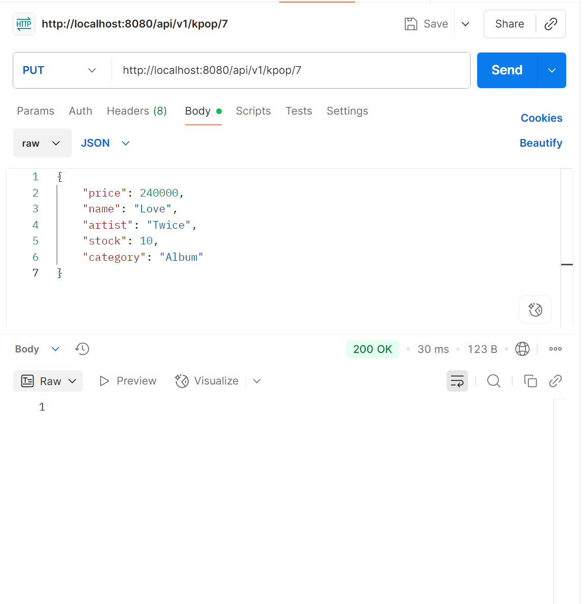

# Descripicón del proyecto 

El proyecto se basa en una tienda de gestión de 
la música más conocida del momento, del genero del KPOP en el cual nos encargamos de la gestión de la venta de los albumnes musica y photocards 

# Como usar cada EndPoint y pruebas 

Metodo - GET 

Este para obtener todos los productos y se usa de la siguiente forma 

url: http://localhost:8080/api/v1/kpop

Metodo - GET por ID 

Este es para obtener un producto de la lista de albumnes de KPOP en especifico

Url: http://localhost:8080/api/v1/kpop/1

Metodo - POST 

Este es para crear un nuevo registros y se necesita el siguiente Body para poder crearlo 

Url: http://localhost:8080/api/v1/kpop

Body: 

{
    "price": 250000,
    "name": "Wing",
    "artist": "BlapckPink",
    "stock": 5,
    "category": "Album de fotos"
}

Metodo - PUT por Id 

Este es para actualizar los registros que ya se encuentran en la base 

Url: http://localhost:8080/api/v1/kpop/7

Metodo - DELETE por Id 

Este es para eliminar de la base de datos un registros por Id 

Url: http://localhost:8080/api/v1/kpop/6

Base de datos general ejecutada en el localhost 

